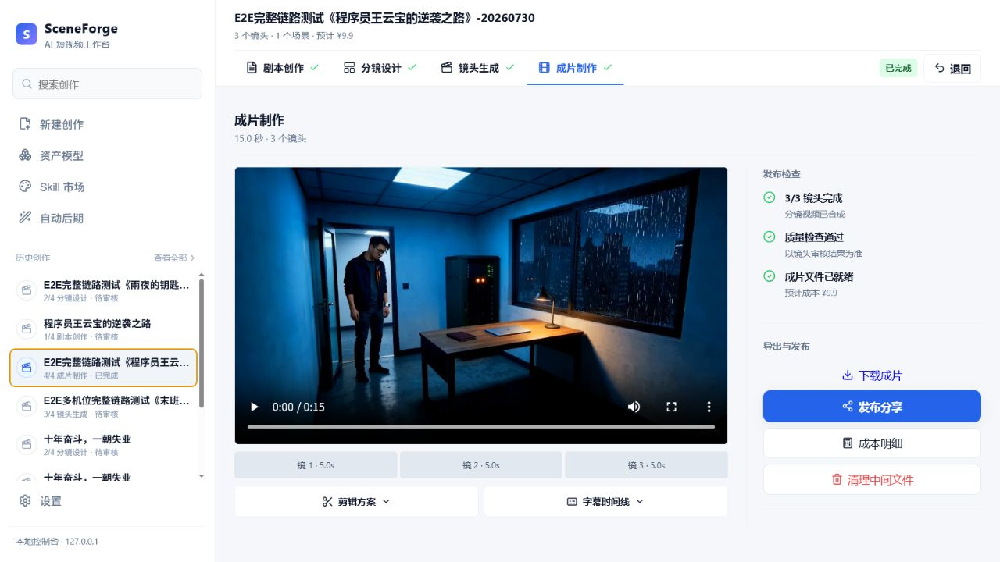
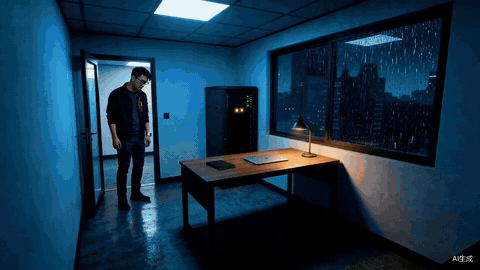
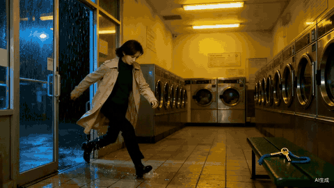
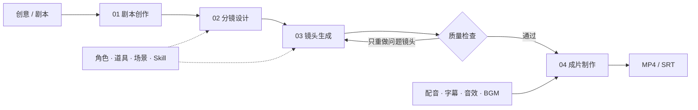

<div align="center">
  <h1>SceneForge</h1>
  <p><strong>把创意和剧本变成可控、可返工、可交付的 AI 成片</strong></p>
  <p>面向个人创作者的本地优先 AI 短视频工作台。外部模型负责生成，SceneForge 负责把剧本、分镜、镜头、声音和成片组织成一条真正好用的生产流程。</p>
  <p><a href="#快速开始">快速开始</a> · <a href="#实际成片">观看样片</a> · <a href="docs/SceneForge用户手册.md">用户手册</a> · <a href="README_EN.md">English</a></p>
</div>



<p align="center"><sub>从剧本到成片都在一个项目中完成：逐镜预览、质量检查、局部返工、字幕剪辑与导出。</sub></p>

## 为什么用 SceneForge

直接调用 Seedance、Veo 或其他视频模型，通常只能得到一次生成结果。SceneForge 解决的是模型之外更耗时间的部分：如何把一个故事稳定地做成完整视频，并在结果不满意时只修改需要修改的地方。

| 直接使用视频模型 | 使用 SceneForge |
|---|---|
| 一段提示词生成一个片段 | 从创意或剧本推进到完整成片 |
| 人物、场景和道具要反复描述 | 角色、道具、场景资产可复用并自动注入 |
| 某个镜头不好，需要手动重新组织上下文 | 单镜头返工、约束锁定、历史版本与回滚 |
| 字幕、配音、音乐和拼接依赖其他工具 | 内置字幕、TTS、音效、BGM 和基础剪辑 |
| 生成文件散落，任务中断后难以恢复 | 本地项目历史、持久化任务和断点继续 |
| 被单一模型的能力和价格绑定 | 图像、视频和语言模型均可按配置切换 |

## 实际成片

以下样片由 SceneForge 端到端生成。点击动态预览可打开带声音的完整 MP4。

<table>
  <tr>
    <td width="50%" align="center">
      <a href="docs/media/rainy-office-demo.mp4"></a><br>
      <sub><b>雨夜办公室</b> · 多镜头人物、场景与光影连续</sub>
    </td>
    <td width="50%" align="center">
      <a href="docs/media/laundromat-demo.mp4"></a><br>
      <sub><b>洗衣店</b> · 动作推进、镜头衔接与字幕成片</sub>
    </td>
  </tr>
</table>

## 创作流程



每个阶段都能查看真实产物。你可以修改剧本和分镜，也可以只返工某个镜头，不必因为局部问题重跑整条视频。

## 关键能力

- **完整生产链**：创意生成、剧本导入、分镜设计、关键帧、镜头视频和成片合成。
- **一致性资产**：固定角色、道具、场景和风格 Skill，减少跨镜头漂移。
- **局部返工**：单镜重生成、返工约束、版本对比、回滚和连续性影响预览。
- **自动后期**：字幕、配音、音效、背景音乐、转场、封面和 AIGC 标识。
- **本地优先**：项目状态和生成媒体默认保存在本机，支持中断恢复和历史创作。
- **供应商可配置**：语言、图像和视频模型通过独立配置接入，避免锁死单一模型。

## 适合谁

- 独立短剧、自媒体和剧情视频创作者。
- 已有创意或剧本，希望减少重复提示词与手工拼接的人。
- 在意人物一致性、局部返工成本和项目可恢复性的个人用户。

SceneForge 当前是本地运行的个人创作工具，不是云端 SaaS 或多人协作平台。生成质量、速度和费用取决于你配置的模型服务，使用前请确认供应商的计费与数据条款。

## 快速开始

需要 Python 3.12、[`uv`](https://docs.astral.sh/uv/)、Node.js 22+、`npm`，并确保 FFmpeg 已加入 `PATH`。

### Windows

```powershell
uv sync --frozen
cd frontend
npm ci
npm run build
cd ..
.\start.bat
```

启动后访问 [http://127.0.0.1:8770/](http://127.0.0.1:8770/)。之后通常只需双击 `start.bat`。

### macOS / Linux

```bash
uv sync --frozen
cd frontend && npm ci && npm run build && cd ..
uv run python main_server.py
```

更完整的安装、模型配置和界面说明见 [SceneForge 用户手册](docs/SceneForge用户手册.md)。

## 模型与数据

模型可直接在设置页面配置，也可以复制 `configs/agent.example.yaml` 为已忽略的 `configs/agent.local.yaml`，或使用 `SCENEFORGE_LLM_API_KEY`、`SCENEFORGE_IMAGE_API_KEY`、`SCENEFORGE_VIDEO_API_KEY` 等环境变量。不要把真实密钥写入公开配置。

| 内容 | 默认位置 |
|---|---|
| 项目状态 | `.sceneforge/` |
| 生成媒体 | `.working_dir/`，可在设置中修改 |
| 用户资产 | `assets/` |
| 用户 Skill | `skills_user/` |

这些运行数据、密钥配置、用户素材和生成媒体默认不会进入源码仓库。Web 服务默认只监听 `127.0.0.1`；开放到局域网前必须配置 `SCENEFORGE_WEB_TOKEN`。安全说明见 [SECURITY.md](SECURITY.md)。

## 开发与贡献

```bash
uv run python scripts/check_repo_hygiene.py
uv run pytest -q
cd frontend && npm run build
cd ../ui && npm test
```

提交代码前请阅读 [CONTRIBUTING.md](CONTRIBUTING.md)。问题和功能建议可通过 [GitHub Issues](https://github.com/lemanhappy/SceneForge/issues) 提交。

## 上游与许可证

SceneForge 最初基于 [HKUDS/ViMax](https://github.com/HKUDS/ViMax) 的生成流水线进行产品化开发，并在此之上增加本地 Web 工作台、资产库、持久化任务、自动后期和质量控制。项目采用 MIT 许可证，详情见 [LICENSE](LICENSE)、[NOTICE](NOTICE)、[THIRD_PARTY_NOTICES.md](THIRD_PARTY_NOTICES.md) 和 [上游来源与许可证](docs/上游来源与许可证.md)。
