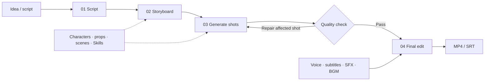

<div align="center">
  <h1>SceneForge</h1>
  <p><strong>Turn an idea or script into an AI video you can control, revise, and deliver</strong></p>
  <p>A local-first AI production studio for individual short-drama and social-video creators. External models generate the media; SceneForge organizes scripts, storyboards, shots, sound, and final delivery into one usable workflow.</p>
  <p><a href="#quick-start">Quick Start</a> · <a href="#generated-demos">Watch Demos</a> · <a href="README.md">中文</a></p>
</div>


<p align="center"><sub>Review every stage in one project: inspect shots, run quality checks, repair only what failed, edit subtitles, and export.</sub></p>

## Why SceneForge

Calling Seedance, Veo, or another video model usually gives you one generated clip. SceneForge handles the production work around the model: turning a story into a complete video and repairing only the parts that need another pass.

| Direct model use | SceneForge |
|---|---|
| One prompt produces one clip | An idea or script becomes a complete video |
| Characters and locations must be described repeatedly | Reusable character, prop, scene, and style assets |
| A bad shot requires manual context reconstruction | Per-shot regeneration, constraints, history, and rollback |
| Subtitles, voice, music, and assembly happen elsewhere | Built-in subtitles, TTS, SFX, BGM, and basic editing |
| Outputs are scattered and interrupted work is fragile | Local project history, durable jobs, and resume support |
| Workflow is tied to one model | Language, image, and video providers are configurable |

## Generated Demos

These samples were produced end to end with SceneForge. Click an animated preview to open the full MP4 with audio.

<table>
  <tr>
    <td width="50%" align="center">
      <a href="docs/media/rainy-office-demo.mp4"></a><br>
      <sub><b>Rainy Office</b> · consistent character, location, and lighting across shots</sub>
    </td>
    <td width="50%" align="center">
      <a href="docs/media/laundromat-demo.mp4"></a><br>
      <sub><b>Laundromat</b> · action progression, shot continuity, and subtitles</sub>
    </td>
  </tr>
</table>

## Production Workflow



Every stage exposes its actual output. You can edit the script and storyboard or regenerate one shot without rerunning the entire production.

## Key Capabilities

- **End-to-end production**: idea generation, script import, storyboards, keyframes, video shots, and final assembly.
- **Consistency assets**: reusable characters, props, scenes, and style Skills reduce drift across shots.
- **Targeted repair**: per-shot regeneration, locked constraints, version comparison, rollback, and continuity impact previews.
- **Automated post-production**: subtitles, voice-over, sound effects, music, transitions, posters, and AIGC labeling.
- **Local-first operation**: project state and generated media stay on your machine by default, with history and resume support.
- **Configurable providers**: language, image, and video models are configured independently.

## Who It Is For

- Independent short-drama, social-video, and narrative creators.
- Creators who already have an idea or script and want less prompt repetition and manual assembly.
- Individual users who care about consistency, targeted repair cost, and recoverable projects.

SceneForge is currently a locally operated personal creation tool, not a hosted SaaS or team collaboration platform. Output quality, latency, and cost depend on the providers you configure. Review their billing and data terms before use.

## Quick Start

Requirements: Python 3.12, [`uv`](https://docs.astral.sh/uv/), Node.js 22+, `npm`, and FFmpeg on `PATH`.

### Windows

```powershell
uv sync --frozen
cd frontend
npm ci
npm run build
cd ..
.\start.bat
```

Open [http://127.0.0.1:8770/](http://127.0.0.1:8770/) after startup. On later runs, double-clicking `start.bat` is normally enough.

### macOS / Linux

```bash
uv sync --frozen
cd frontend && npm ci && npm run build && cd ..
uv run python main_server.py
```

## Models And Local Data

Configure models in Settings, copy `configs/agent.example.yaml` to the ignored `configs/agent.local.yaml`, or use environment variables such as `SCENEFORGE_LLM_API_KEY`, `SCENEFORGE_IMAGE_API_KEY`, and `SCENEFORGE_VIDEO_API_KEY`. Never commit real credentials.

| Content | Default location |
|---|---|
| Project state | `.sceneforge/` |
| Generated media | `.working_dir/`, configurable in Settings |
| User assets | `assets/` |
| User Skills | `skills_user/` |

Runtime data, local credentials, user media, and generated outputs are excluded from source control by default. The Web server binds to `127.0.0.1`; configure `SCENEFORGE_WEB_TOKEN` before exposing it to a network. See [SECURITY.md](SECURITY.md).

## Development

```bash
uv run python scripts/check_repo_hygiene.py
uv run pytest -q
cd frontend && npm run build
cd ../ui && npm test
```

Read [CONTRIBUTING.md](CONTRIBUTING.md) before submitting code. Bugs and feature requests belong in [GitHub Issues](https://github.com/lemanhappy/SceneForge/issues).

## Upstream And License

SceneForge began as a product-focused derivative of the [HKUDS/ViMax](https://github.com/HKUDS/ViMax) generation pipeline. It adds a local Web workspace, reusable assets, durable jobs, automated post-production, and quality controls. SceneForge is MIT-licensed; see [LICENSE](LICENSE), [NOTICE](NOTICE), [THIRD_PARTY_NOTICES.md](THIRD_PARTY_NOTICES.md), and [upstream provenance](docs/上游来源与许可证.md).
