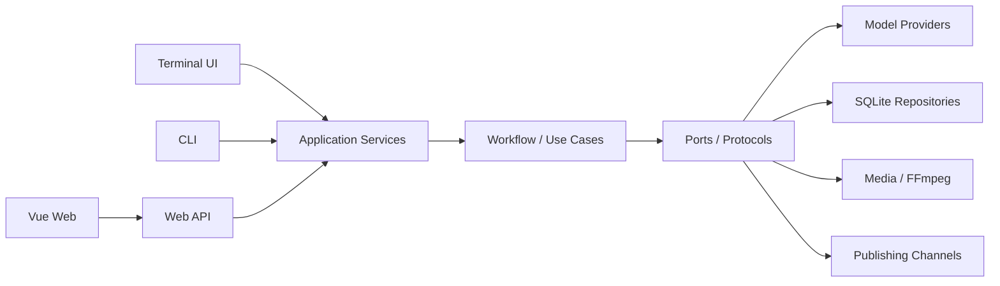

# SceneForge 开源优化方案

> 适用范围：SceneForge 当前 Python 后端、Vue Web、React TUI、SQLite 数据层、模型 Provider 与桌面程序发布链路
> 目标：在不推翻现有生成能力的前提下，将项目整理为安全、可安装、可扩展、可贡献、可持续发布的开源项目。

## 1. 结论

SceneForge 的核心业务架构可以保留，不需要重写。现有分阶段工作流、SQLite 持久化队列、数据库迁移、Provider Registry、生成协议、Stage Handler 和自动化测试具备继续演进的基础。

开源前必须优先解决以下问题：

1. 本地密钥配置仍被 Git 跟踪。
2. Git `origin` 仍指向上游 HKUDS/ViMax。
3. 运行日志、生成资产、测试数据和源码目录混放。
4. Python 项目尚未形成稳定的可安装包和跨平台 CLI。
5. 缺少 CI、代码规范、类型检查、安全扫描和开源协作文件。
6. 工作流、生成管线和部分前端组件体积过大，模块边界仍有反向依赖。

因此推荐采用“先满足公开门槛，再渐进优化架构”的路线。

## 2. 优化原则

- **不推翻核心流程**：保留四阶段审核、SQLite 队列、历史版本和恢复机制。
- **运行数据与源码分离**：源码仓库保持只读，用户配置和生成数据进入系统数据目录。
- **依赖指向业务核心**：应用层依赖端口协议，不直接依赖模型供应商和适配器私有函数。
- **开源默认安全**：不提交密钥，不默认开放远程访问，不在 URL 长期携带访问令牌。
- **先兼容后移除**：旧目录、旧配置和旧接口至少保留一个公开版本的迁移期。
- **每阶段可独立发布**：避免一次性移动全部目录导致长期不可用。

## 3. 目标架构



建议逐步收敛为以下目录结构：

```text
src/sceneforge/
  domain/                 # 纯业务模型、状态、规则
  application/            # 用例、工作流、审核阶段、任务编排
  ports/                  # LLM、图片、视频、存储、队列、发布协议
  infrastructure/
    persistence/          # SQLite、迁移、Repository 实现
    providers/            # Seedream、Seedance、Veo 等供应商实现
    media/                # FFmpeg、字幕、音频、合成
    channels/             # 飞书及后续发布渠道
  presentation/
    web/                  # HTTP API 与静态资源服务
    cli/                  # 跨平台命令入口
  bootstrap.py            # 唯一依赖装配入口
apps/
  web/                    # Vue 前端
  tui/                    # React Ink TUI
resources/                # 默认配置、提示词、内置 Skill
tests/
```

该结构是目标方向，不要求第一阶段立即移动全部模块。优先消除依赖方向问题，再逐步迁移文件。

## 4. 分阶段实施方案

### P0：公开仓库安全门槛

#### 工作内容

- 停止跟踪 `configs/agent.local.yaml`，只提交脱敏的 `configs/agent.example.yaml`。
- 增加密钥扫描，覆盖 API Key、Token、Webhook、Cookie 和私钥。
- 扩充 `.gitignore`：
  - `.server-*.log`
  - `server-*.log`
  - `.public_artifacts/`
  - `.test_console/`
  - `.verify_output/`
  - `.tmp/`
  - `.web_token.txt`
  - 用户生成的角色、道具、场景、LoRA、上传文件和媒体文件
- 将上游远端改名为 `upstream`，自己的仓库设置为 `origin`。
- 检查 Git 历史中是否存在密钥、大文件、生成视频或不应公开的数据。
- 补充 `NOTICE`，明确 SceneForge 与 HKUDS/ViMax 的来源关系。
- 核对 `LICENSE` 版权主体、第三方模型 SDK、字体、音乐、图片和 benchmark 数据许可证。
- 仅保留明确可再分发的演示资产；其他素材从公开仓库移除。

#### 交付物

- 安全的 `.gitignore`
- `configs/agent.example.yaml`
- `NOTICE`
- `SECURITY.md`
- 密钥扫描配置
- 素材与依赖许可证清单
- 干净且可审查的首个 SceneForge 提交

#### 验收标准

- `git status` 干净。
- 全仓库和 Git 历史密钥扫描无结果。
- 全新克隆不包含用户项目、日志、密钥和生成媒体。
- `origin` 指向 SceneForge 自有仓库，`upstream` 指向 HKUDS/ViMax。

### P1：标准打包与可复现开发环境

#### 工作内容

- 为 `pyproject.toml` 增加：
  - `[build-system]`
  - 明确的包发现配置
  - `license`、作者、项目主页、源码、问题反馈地址
  - `[project.scripts] sceneforge = "sceneforge.cli:main"`
- 将 Bash `sceneforge` 脚本的逻辑迁移到 Python CLI，确保 Windows、macOS、Linux 一致。
- 将依赖拆成可选分组：
  - `core`
  - `video`
  - `novel`
  - `google`
  - `desktop`
  - `dev`
- 固定支持的 Python 版本；首个公开版本建议先只承诺 Python 3.12。
- 增加统一开发命令，例如：
  - `sceneforge dev`
  - `sceneforge server`
  - `sceneforge doctor`
  - `sceneforge migrate`
- 增加环境诊断，检查 Python、Node.js、FFmpeg、模型配置和存储目录。

#### 交付物

- 可构建的 wheel/sdist
- 跨平台 `sceneforge` CLI
- `sceneforge doctor`
- 一条命令完成的开发环境初始化

#### 验收标准

- 在空目录中安装 wheel 后可以运行 `sceneforge --help`。
- 不依赖源码根目录也能启动服务。
- 未安装可选供应商依赖时，核心界面仍能启动并给出明确提示。

### P2：CI、质量门禁与协作规范

#### 工作内容

- 增加 GitHub Actions：
  - Python 单元测试与契约测试
  - Windows/Linux Python 3.12 矩阵
  - Vue 构建
  - TUI 测试
  - wheel/sdist 构建验证
- 引入 Ruff，统一格式、导入和基础静态检查。
- 分阶段引入 Pyright 或 Mypy，优先覆盖 `domain`、`ports`、`repositories`。
- 前端增加 ESLint、Prettier 和组件测试。
- 增加 Playwright 最小冒烟测试：启动、打开首页、历史项目、设置、Skill/LoRA 页面。
- 增加覆盖率报告，但不单纯追求百分比；重点覆盖状态转换、计费调用前置检查和恢复链路。
- 增加 `pre-commit`，执行格式、密钥、超大文件和尾随空格检查。

#### 开源协作文件

- `CONTRIBUTING.md`
- `CODE_OF_CONDUCT.md`
- `SECURITY.md`
- Issue 模板
- Pull Request 模板
- `ARCHITECTURE.md`
- Provider 接入指南
- Skill/LoRA 扩展指南

#### 验收标准

- 所有 PR 必须通过 CI 才能合并。
- 新贡献者按照 README 能独立跑通测试和 Web 构建。
- CI 日志不包含密钥、用户目录和模型请求正文。

### P3：配置与运行数据彻底分离

#### 工作内容

- 使用 `platformdirs` 获取系统目录：
  - Windows：`%LOCALAPPDATA%/SceneForge`
  - macOS：`~/Library/Application Support/SceneForge`
  - Linux：遵循 XDG 目录规范
- 将以下内容迁出源码仓库：
  - `agent.local.yaml`
  - `.sceneforge/sceneforge.db`
  - 用户 Skill 与 LoRA
  - 用户角色、道具、场景
  - 日志、缓存、临时文件
- 默认配置和内置 Skill 作为只读 resources 随包发布。
- 设置页面只写用户配置，不再修改仓库中的 `configs/*.yaml`。
- API Key 首版至少写入仓库外配置；桌面版后续接入系统 Keyring。
- 提供旧目录自动迁移和迁移报告，失败时不删除旧数据。

#### 验收标准

- 安装目录和源码目录保持只读仍可正常运行。
- 启动、配置模型、生成项目不会使 Git 工作区变脏。
- 旧 `.sceneforge` 项目可迁移且可回滚。

### P4：后端模块边界优化

#### 4.1 拆分生成管线

将 `script2video_pipeline.py` 拆为：

- `ScriptPlanner`
- `CharacterReferenceService`
- `StoryboardPlanner`
- `KeyframeGenerationService`
- `ShotVideoGenerationService`
- `SceneAssemblyService`
- `FinalAssemblyService`

移除 `from agents import *`，改为显式导入。

#### 4.2 收缩 WorkflowEngine

`WorkflowEngine` 只负责：

- 状态转换
- 审核门
- 中止/继续/重试
- 失效传播
- 调用对应 Stage Handler

剧本、分镜、镜头、成片的具体执行全部进入独立 Handler。目标是将工作流状态机控制在可完整阅读和单独测试的规模内。

#### 4.3 建立端口协议

新增或统一以下协议：

- `ChatModelPort`
- `ImageGeneratorPort`
- `VideoGeneratorPort`
- `AssetRepositoryPort`
- `ProjectRepositoryPort`
- `JobQueuePort`
- `ArtifactStorePort`
- `PublisherPort`

禁止 `services` 直接导入 `agent_runtime.sceneforge_adapters` 中以下划线开头的私有构造函数。所有实现由 `bootstrap.py` 创建并注入。

#### 4.4 收敛持久化

- SQLite 继续作为桌面版默认存储，不引入 Redis/Celery。
- JSON Session 后端只保留迁移兼容；经过一个公开版本后评估移除。
- 所有 Schema 变化必须通过不可修改的 SQL migration。
- Repository 契约测试继续覆盖 SQLite 实现。

#### 验收标准

- application/services 不依赖具体供应商类。
- 单个 Stage Handler 可以用 Fake Provider 独立测试。
- 增加一个新视频 Provider 不需要修改 WorkflowEngine。
- SQLite 迁移可重复执行并支持旧版本数据库升级。

### P5：Web API 与安全加固

#### 工作内容

- 为请求体设置最大尺寸，限制并发线程和长连接数量。
- 非回环地址启动时强制设置访问令牌，除非用户显式使用危险开关确认。
- 不再通过长期 `?token=` 访问媒体，改用：
  - HttpOnly Session Cookie，或
  - 短期签名媒体 URL
- 将 `Access-Control-Allow-Origin: *` 改为明确的本地来源策略。
- 统一 API 错误结构，外部响应不直接返回 Python 异常、堆栈或本地路径。
- 为所有请求增加 `request_id`，日志可按任务和项目关联。
- 建立请求/响应数据模型和 OpenAPI 文档。
- 当前自定义 HTTP 服务可先加固；当第三方客户端和插件增多时，再迁移到 FastAPI 等带类型契约的框架。

#### 验收标准

- `0.0.0.0` 无 Token 时启动失败。
- 大请求、非法 JSON、路径穿越和并发滥用有明确限制。
- API 返回不包含密钥、内部异常和不必要的绝对路径。
- 前后端契约可自动验证。

### P6：前端工程化

#### 工作内容

- 将 `ReviewContent.vue` 按阶段拆为：
  - `ScriptReview`
  - `StoryboardReview`
  - `ShotGenerationReview`
  - `FinalReview`
- 将任务轮询、历史版本、媒体 URL、保存状态等逻辑提取为 composables。
- 将全局 `styles.css` 拆成 tokens、layout、components、pages 和 dark-theme。
- 为 API 层增加 TypeScript 类型和统一错误处理。
- 当跨页面共享状态继续增加时再引入 Pinia，不为当前简单状态提前增加复杂度。
- Vue Web 是唯一界面；旧 `webui/` 回退实现已移除。
- React TUI 作为独立应用维护；若没有明确用户群，可降级为实验功能，避免阻塞主版本发布。

#### 验收标准

- 单个阶段页面可以独立测试。
- 前端不再依赖一个超大审核组件处理全部业务。
- 旧 Web UI 移除后，构建产物由发布流程自动打包。

### P7：Provider、Skill 与 LoRA 开放生态

#### 工作内容

- 定义公开的 Provider 插件接口和版本号。
- Provider 通过 entry point 或明确注册表加载，不要求修改核心源码。
- 能力声明统一覆盖：
  - 文生图/图生图
  - 文生视频/图生视频
  - 首尾帧
  - 多参考图
  - 角色 ID
  - 原生 LoRA
  - 远程任务恢复与取消
- Skill 增加 manifest、版本、作者、许可证和适用阶段。
- LoRA 条目增加来源、许可证、基础模型、文件校验值和兼容性检查。
- 市场条目只保存元数据；下载或执行外部内容前明确提示来源与风险。

#### 验收标准

- 第三方可以在独立仓库实现 Provider。
- 不支持原生 LoRA 的 Provider 不会静默忽略配置。
- 未知 Skill/LoRA 格式不会执行任意代码。

### P8：版本发布与桌面 EXE

#### 工作内容

- 明确首个公开版本号，不直接沿用上游版本语义。
- 建立 Conventional Commits 或明确的变更类型规范。
- 自动生成 changelog 和 GitHub Release。
- 发布内容包括：
  - Python wheel/sdist
  - Web 构建产物
  - Windows EXE/安装器
  - 校验值
  - SBOM
- EXE 构建使用同一个 `bootstrap.py`，不单独复制一套启动逻辑。
- 首次启动向导检查 FFmpeg、存储目录、模型配置和数据迁移。
- 自动更新必须使用签名发布文件，不能执行未验证的下载内容。

#### 验收标准

- CI 可以从干净 tag 重现发布文件。
- 新电脑无需源码目录即可启动。
- 卸载程序默认不删除用户项目和媒体文件。

## 5. 推荐实施顺序

```text
P0 公开安全门槛
  -> P1 标准打包
  -> P2 CI 与协作规范
  -> P3 数据目录分离
  -> P4 后端模块边界
  -> P5 API 安全与契约
  -> P6 前端工程化
  -> P7 插件生态
  -> P8 EXE 与正式发布
```

P0、P1、P2、P3 完成后再公开仓库最稳妥。P4 至 P8 可以在公开后通过 roadmap 和小版本持续推进。

## 6. 首次公开发布门槛

以下项目全部满足后，才建议把仓库设为 Public：

- [ ] 没有被跟踪的真实密钥文件。
- [ ] Git 历史完成密钥和大文件扫描。
- [ ] `origin` 为 SceneForge 自有仓库，`upstream` 为原始项目。
- [ ] LICENSE、NOTICE、SECURITY、CONTRIBUTING 完整。
- [ ] 用户生成数据和演示数据已经分离。
- [ ] 全新克隆可按 README 启动。
- [ ] Python、Vue、TUI 和打包构建全部通过 CI。
- [ ] 非本机监听默认强制鉴权。
- [ ] 至少一个无需付费调用的演示或 Mock 工作流可运行。
- [ ] 文档明确模型费用、数据发送范围、隐私风险和第三方服务责任。

## 7. 不建议当前执行的重构

- 不建议立即拆成微服务。
- 不建议为桌面单机版引入 Redis、Celery、Kafka 或 Kubernetes。
- 不建议在没有 API 契约前先整体迁移 Web 框架。
- 不建议一次性移动所有 Python 文件到新目录。
- 不建议同时重写后端、前端和 EXE 打包链路。

这些改动会增加发布风险，却不会优先解决开源安全和贡献者体验问题。

## 8. 最终目标

完成本方案后，SceneForge 应达到以下状态：

1. 普通用户可以通过 EXE 或安装包使用，不需要高配置电脑或本地训练 LoRA。
2. 开发者可以从干净仓库快速启动、测试并添加 Provider。
3. 用户数据、密钥和生成内容不会进入源码仓库。
4. 工作流阶段可以独立替换、测试和恢复。
5. 第三方 Skill、LoRA 和模型 Provider 有清晰、安全、稳定的扩展协议。
6. 每个公开版本均可由 CI 重现、验证和发布。
