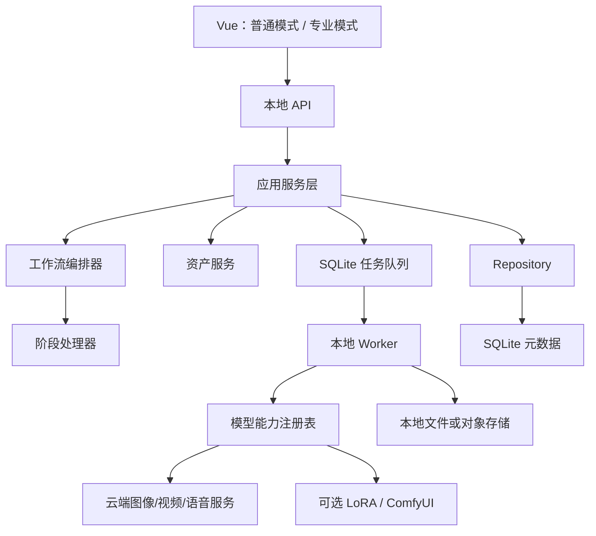

# SceneForge 项目优化方案

> 文档版本：v1.0
> 编写日期：2026-07-28
> 适用范围：`SceneForge` 现有桌面与 Web 代码
> 核心目标：面向普通用户提供低门槛、可恢复、成本透明的 AI 短剧与自媒体生产工具，并为后续 Windows EXE 交付保留稳定架构。

---

## 1. 执行摘要

SceneForge 当前已经具备从创意或剧本到分镜、镜头生成、配音、字幕、合成和质量检查的主要链路，不需要推倒重写。下一阶段的重点不是继续堆叠模型和 Agent，而是把现有能力整理为普通用户能够稳定使用的产品。

本方案确定以下核心决策：

1. 采用“模块化单体 + SQLite + 本地 Worker”，不引入 Redis、RabbitMQ、Kafka 或微服务。
2. 默认使用云端模型，基础 EXE 不包含 GPU 模型，不要求用户拥有高配置电脑。
3. 参考图是普通用户的人物一致性默认方案；LoRA、ComfyUI 和供应商角色 ID 是专业扩展。
4. 保留简单的分阶段创作流程；节点画布和专业参数只在高级模式提供。
5. 将内存任务改为 SQLite 持久化任务，使程序重启、断网和生成失败后可以恢复。
6. 将角色身份与渲染手段分离，同一个角色可以同时拥有参考图、LoRA 和供应商角色 ID。
7. 建立模型能力注册表，由系统按照镜头需求、预算和质量档位自动选择模型。
8. Windows 版本采用安装包或 onedir 结构交付，捆绑前端与 FFmpeg，用户无需安装 Python、Node 或数据库。

推荐实施顺序：

```text
数据模型与持久化
→ 本地任务队列
→ 工作流拆分
→ 统一资产与角色身份
→ 模型能力注册表
→ 人物一致性增强
→ 大众化界面
→ EXE 打包与发布
```

---

## 2. 产品定位

### 2.1 目标用户

SceneForge 的首要用户不是模型工程师，而是：

- 希望用一句话、故事梗概或剧本制作 AI 短剧的普通创作者。
- 希望快速制作知识、营销、口播和图文类视频的自媒体用户。
- 需要复用固定角色，但不会训练 LoRA 的内容团队。
- 了解模型、LoRA 或 ComfyUI，希望获得更多控制能力的专业用户。

### 2.2 产品原则

- **默认简单**：普通模式不展示供应商协议、Seed、LoRA 权重、并发数和节点连线。
- **生成前确认**：昂贵的视频调用前必须提供分镜、关键帧和费用确认。
- **局部可重做**：角色、分镜、首帧和单镜头均可独立修改，不要求整片重跑。
- **失败可恢复**：任务状态、远程任务 ID 和生成结果必须持久保存。
- **成本可解释**：区分预估费用、已提交费用和实际费用。
- **云端默认**：基础版本不依赖本地显卡；本地模型仅作为可选扩展。
- **专业能力渐进披露**：LoRA、模型选择和节点工作台不影响普通用户的主流程。

### 2.3 两条产品主线

#### AI 短剧模式

```text
输入故事或剧本
→ 自动提取角色、场景和道具
→ 确认角色形象
→ 审核详细分镜
→ 生成低成本关键帧预览
→ 确认费用
→ 生成镜头视频
→ 一致性检查与局部重做
→ 配音、字幕、BGM 和合成
→ 导出
```

#### 自媒体模式

```text
输入主题或文案
→ 自动生成内容结构
→ 匹配素材或生成图片
→ 选择声音和字幕样式
→ 生成预览
→ 合成与导出
```

两条主线共享资产、任务、供应商、音频、字幕、时间线和导出基础设施，但不应强行使用同一条固定流水线。

---

## 3. 当前架构评估

### 3.1 可保留的现有基础

以下能力应保留并继续演进：

- `services/workflow_engine.py`：分阶段审核与状态推进。
- `pipelines/`：Idea、Script 和 Novel 三类生成流水线。
- `characters/`：固定角色资产、角色工作台和参考图版本。
- `quality/consistency_critic.py`：身份、画面和时序质量检查。
- `audio/`、`subtitles/`、`editing/`：配音、字幕、BGM、音效和后期处理。
- `tools/protocols.py`：图像和视频生成器协议。
- `tools/render_backend.py`：配置驱动的生成后端基础。
- `frontend/`：Vue 前端和分阶段审核界面。
- `services/cost.py`、`services/budget.py`：成本估算和预算护栏。

### 3.2 需要优先解决的问题

| 问题 | 当前表现 | 后续影响 | 优先级 |
|---|---|---|---|
| 任务仅保存在内存 | 程序重启后任务记录消失，无法真正取消 | EXE 不可靠、可能重复扣费 | P0 |
| 会话集中在单个 JSON | 每次更新读写整个文件 | 项目增多后竞争、迁移和查询困难 | P0 |
| `WorkflowEngine` 职责持续增长 | 状态、资产、预算、生成和文件失效混在一起 | 新增工作流风险越来越高 | P0 |
| 供应商构建存在硬编码分支 | 新模型需要修改核心代码 | 难以自动路由和扩展 | P1 |
| 角色资产类型互斥 | 参考图与 LoRA 不能自然并存 | 无法实现普通版和专业版共用角色 | P1 |
| 产物状态依赖文件是否存在 | 输入变化与缓存失效关系不明确 | 容易复用过期结果 | P1 |
| 多角色一致性不足 | 质检主要选择首个固定角色和首尾帧 | 同框人物与视频中段可能漂移 | P1 |
| 自定义 HTTP 路由继续膨胀 | 参数校验和 API 契约依赖手工维护 | 后期接口维护成本高 | P2 |
| 基础依赖偏重 | FAISS、Torch、OpenCV 等可能进入基础包 | EXE 体积大、启动慢 | P2 |

---

## 4. 目标架构

### 4.1 架构形态



### 4.2 模块职责

#### 表现层

- Vue 界面、API 路由和请求响应模型。
- 只负责输入校验、权限检查、调用应用服务和返回结果。
- 不直接操作数据库、生成器或工作目录。

#### 应用层

- 项目创建、资产确认、审核、任务提交和导出等用例。
- 负责跨领域对象协调，但不包含具体供应商 HTTP 请求。
- 普通模式和专业模式调用同一套应用服务。

#### 领域层

- 项目、章节、场景、镜头、角色身份、资产版本、生成任务、审核和费用记录。
- 定义状态转换、有效性规则和依赖关系。
- 不依赖 Vue、HTTP、SQLite 或具体模型 SDK。

#### 基础设施层

- SQLite Repository、本地文件存储、供应商适配器、FFmpeg 和密钥存储。
- 实现领域层定义的接口。

#### Worker

- 从本地持久化队列领取任务。
- 调用云端模型、轮询远程状态、下载产物并更新进度。
- 支持取消、重试、恢复、幂等和并发控制。

### 4.3 增量迁移原则

不建议立即移动所有现有目录。应先增加接口和兼容层，再逐步替换内部实现：

```text
SessionIndex          → SessionRepository 兼容实现 → SQLiteRepository
JobRunner             → LocalJobQueue 兼容接口    → SQLiteJobQueue
WorkflowEngine        → 保留外部接口              → StageHandler 拆分
CharacterAssetRegistry→ 兼容角色读取              → AssetCatalog
sceneforge_adapters builders→ ProviderRegistry
```

---

## 5. 数据与持久化方案

### 5.1 存储原则

- SQLite 保存结构化元数据和任务状态。
- 图片、音频和视频继续保存在本地文件系统。
- 数据库记录相对路径、Hash、版本、来源和生成参数。
- 使用数据库迁移脚本，不在启动时依赖零散的手工补字段。
- 开启 SQLite WAL 模式，所有状态转换使用事务。
- Repository 层隔离数据库实现，为未来 PostgreSQL 留出替换空间。

### 5.2 核心数据表

| 表 | 主要用途 |
|---|---|
| `projects` | 项目、模式、画幅、语言、风格、预算 |
| `episodes` | 短剧分集或内容章节 |
| `scenes` | 场景级文本与顺序 |
| `shots` | 分镜、时长、镜头语言、表演要求和准备状态 |
| `assets` | 角色、场景、道具、风格、声音等逻辑资产 |
| `asset_versions` | 资产图片、描述、状态和版本历史 |
| `character_identities` | 角色稳定身份和禁止变化特征 |
| `render_bindings` | LoRA、供应商角色 ID、3D 等渲染绑定 |
| `generation_jobs` | 本地任务状态、重试、进度和远程任务 ID |
| `artifacts` | 图片、视频、音频和工程文件元数据 |
| `artifact_inputs` | 产物依赖的输入版本与 Hash |
| `reviews` | 剧本、分镜、镜头和成片审核记录 |
| `cost_records` | 预估费用、提交费用和实际费用 |
| `provider_profiles` | 模型配置、能力和启用状态 |

### 5.3 产物版本与失效

每个产物保存 `input_hash`，Hash 至少包含：

- 上游文本或资产版本。
- 模型和供应商。
- Prompt 模板版本。
- 用户可见参数。
- 参考图片 Hash。
- LoRA 或供应商角色绑定版本。

当输入 Hash 变化时，将下游产物标记为 `stale`，但不立即删除旧文件。用户确认重新生成后产生新版本，旧版本可回滚或由清理策略删除。

---

## 6. 本地持久化任务队列

### 6.1 为什么 EXE 仍需要任务队列

任务队列解决的是长耗时和付费调用的可靠性，而不是服务器规模问题：

- 防止用户重复点击造成重复提交和扣费。
- 控制图片和视频生成并发。
- 保存远程任务 ID，程序重启后继续查询。
- 支持断网重试和失败原因展示。
- 支持单镜头重做和批量任务进度。
- 支持关闭界面后继续生成。

### 6.2 状态模型

```text
queued
→ running
→ waiting_provider
→ succeeded

queued/running/waiting_provider
→ cancel_requested
→ canceled

running/waiting_provider
→ retry_wait
→ running

running/waiting_provider
→ failed

程序异常退出：running/waiting_provider → interrupted
```

### 6.3 核心字段

```text
job_id
project_id
job_type
entity_type / entity_id
idempotency_key
state
priority
progress_current / progress_total
provider / model
remote_task_id
attempt / max_attempts
request_payload_json
result_json
error_code / error_message
estimated_cost / actual_cost
cancel_requested_at
created_at / started_at / finished_at
```

### 6.4 执行策略

- 默认只并发执行 1 个视频任务。
- 图片任务根据供应商限制配置为 2 至 4 个并发。
- 同一镜头的同一输入版本只能存在一个有效任务。
- 429、网络超时和部分 5xx 使用指数退避。
- 参数错误、鉴权失败和内容审核失败不自动重试。
- 供应商支持远程取消时执行真实取消。
- 供应商不支持取消时停止本地后续处理，但继续对账远程结果，避免错误重提。
- 程序启动时扫描 `interrupted` 任务，优先查询远程任务，再决定接管或允许重试。

### 6.5 进程结构

开发阶段可在同一进程运行 Worker。正式 EXE 建议由主程序启动一个隐藏子进程：

- UI 或本地 API 重启不会直接丢失生成状态。
- FFmpeg 或第三方 SDK 异常不拖垮界面。
- 主界面重新打开后可以连接现有任务。
- 用户仍只启动一个应用程序。

---

## 7. 工作流优化

### 7.1 拆分 `WorkflowEngine`

`WorkflowEngine` 最终只负责：

- 状态转换。
- 阶段顺序和审核门。
- 阶段处理器调度。
- 失败后的恢复入口。
- 下游失效标记。

建议拆分阶段处理器：

```text
ScriptStageHandler
EntityExtractionHandler
AssetPreparationHandler
StoryboardStageHandler
KeyframePreviewHandler
RenderStageHandler
QualityStageHandler
PostProductionHandler
PublishStageHandler
```

### 7.2 工作流模板

使用内部 `WorkflowRecipe` 描述不同产品流程，界面不展示节点：

```yaml
short_drama:
  - script
  - entity_extraction
  - asset_preparation
  - storyboard
  - keyframe_preview
  - cost_review
  - render
  - quality
  - postproduction
  - export

self_media:
  - copywriting
  - material_preparation
  - voice
  - timeline
  - postproduction
  - export
```

### 7.3 镜头准备状态

镜头在提交付费视频生成前应具备独立准备状态：

| 状态 | 含义 |
|---|---|
| `draft` | 分镜刚生成或正在编辑 |
| `needs_assets` | 缺少角色、场景或道具绑定 |
| `needs_prompt_review` | Prompt 或台词时长需要确认 |
| `ready` | 输入完整，可以生成 |
| `generating` | 已提交生成 |
| `review_required` | 已有结果，等待用户或自动质检 |
| `approved` | 结果已选定，可以进入合成 |

### 7.4 详细分镜数据

详细分镜不能只保存为一段不可编辑的长文本。应同时保存结构化字段和可阅读文本：

```text
shot.start_seconds / end_seconds
camera.shot_size / movement / angle
blocking
gaze
breathing
facial_expression
micro_actions
dialogue
voice_performance
environment
lighting
style_constraints
negative_constraints
visible_character_ids
reference_asset_ids
```

分镜编辑器按时间段展示表演节拍，例如 `0-3秒`、`3-6秒`，并允许只修改某个节拍或字段。

---

## 8. 统一资产与角色身份

### 8.1 通用资产目录

将当前角色库逐步升级为 `AssetCatalog`：

```text
character
scene
prop
costume
style_reference
voice
music
sound_effect
```

资产支持：

- 全局资产和项目资产。
- 版本历史和回滚。
- 标签、别名和搜索。
- 手动上传与 AI 生成。
- 生成来源、许可证和使用范围记录。
- 引用计数，避免误删正在使用的资产。

### 8.2 角色身份模型

当前 `CharacterAsset.type` 不应继续承担互斥的渲染方式。目标模型：

```text
CharacterIdentity
├── identity_profile
│   ├── facial_features
│   ├── hairstyle
│   ├── body_features
│   ├── age_range
│   ├── signature_features
│   └── forbidden_changes
├── reference_sets[]
│   ├── front
│   ├── side
│   ├── back
│   ├── full_body
│   └── expressions[]
├── outfit_versions[]
└── render_bindings[]
    ├── LoRABinding
    ├── ProviderCharacterBinding
    └── ThreeDModelBinding
```

### 8.3 普通用户路径

1. 用户上传 1 至 5 张照片，或者由系统生成角色。
2. 系统检查清晰度、遮挡、角度和是否为同一人。
3. 自动生成角色身份描述和参考集合。
4. 用户只确认“像不像”和“是否作为固定角色”。
5. 后续镜头自动选择合适参考图和模型。

### 8.4 专业用户路径

高级设置中允许：

- 绑定一个或多个 LoRA。
- 设置基础模型、触发词和默认权重。
- 绑定供应商角色 ID。
- 指定 ComfyUI 工作流。
- 为不同服装和年龄阶段建立角色变体。

LoRA 是角色的渲染绑定，不是使用角色库的前置条件。

---

## 9. 人物一致性优化

### 9.1 生成前约束

- 每个镜头显式绑定可见角色和服装版本。
- 根据景别选择正面、侧面、全身或表情参考。
- 多角色同框时分别建立角色参考，不只使用第一名角色。
- 在 Prompt 中注入稳定身份特征和禁止变化项。
- 生成全片风格参考帧，统一画风、光线和色彩。
- 首尾镜头或连续动作使用前一镜尾帧作为补充参考，但不能替代角色身份参考。

### 9.2 生成后质检

质检维度：

- 面部身份。
- 发型和年龄。
- 服装版本。
- 身材和标志性特征。
- 场景和道具连续性。
- 全片画风。
- 首帧、中间帧和尾帧的时序稳定性。
- Prompt 遵循度和画面可用性。

默认对视频抽取首帧、25%、50%、75% 和尾帧。多角色镜头对每个角色分别评分。

### 9.3 自动修复策略

- 身份失败：增强角色参考和身份约束。
- 服装失败：锁定服装版本并更换参考图。
- 风格失败：提高风格参考权重。
- 时序失败：降低动作复杂度或拆分镜头。
- 多次失败：停止自动重试，提示用户选择候选、换模型或拆镜。
- 自动重试次数和最大费用受预算护栏限制。

### 9.4 质量基准

建立固定回归集：

- 单角色近景、全身和侧脸。
- 双角色同框。
- 古装服装连续性。
- 室内外场景切换。
- 大幅动作和转身。
- 哭泣、微笑、呼吸和细微表情。

每次新增模型或修改 Prompt 后，在固定集上统计一致性通过率、失败类型、平均重试次数和单镜成本。

---

## 10. 模型能力注册表

### 10.1 能力描述

每个模型配置至少声明：

```text
provider
model_id
media_type
text_to_image
image_to_image
text_to_video
image_to_video
first_last_frame
multi_reference
multi_character_reference
provider_character_id
lora
supported_aspect_ratios
supported_durations
max_reference_count
async_generation
remote_cancel
estimated_cost
quality_tier
enabled
```

### 10.2 自动路由

用户只选择：

- 省钱。
- 均衡。
- 高质量。

系统按照以下顺序筛选：

1. 是否满足镜头能力要求。
2. 是否在用户预算内。
3. 是否满足画幅、时长和参考图数量。
4. 当前供应商是否可用、是否限流。
5. 质量档位和预计完成时间。

高级用户可以覆盖自动选择，但系统仍需执行能力校验。

### 10.3 账户使用方式

大众版本推荐：

- 默认使用平台余额或平台托管供应商。
- 首次使用不要求理解 API Key。
- 自带 API Key 作为高级选项。
- API Key 使用 Windows Credential Manager 或 DPAPI 保存，不写入明文配置。

---

## 11. 大众化界面方案

### 11.1 普通模式

第一屏直接进入创作，不使用营销落地页。入口只保留：

- AI 短剧。
- 自媒体视频。
- 打开已有项目。

短剧创建表单默认只显示：

- 故事或剧本。
- 视频时长。
- 横屏或竖屏。
- 作品风格。
- 已有角色选择。
- 省钱、均衡或高质量。

### 11.2 项目页面

使用稳定的步骤导航：

```text
内容 → 角色与资产 → 分镜 → 预览 → 生成 → 成片
```

每一步只展示当前需要完成的操作。技术错误转换为用户可执行提示，例如：

```text
不要显示：HTTP 429 / provider timeout
显示：当前生成服务繁忙，任务将在 38 秒后自动重试
```

### 11.3 候选与局部重做

- 关键帧默认生成 1 个候选，可选择“再来一版”。
- 用户选定关键帧后才允许提交昂贵视频任务。
- 镜头卡片提供接受、重做、修改描述和查看历史版本。
- 默认不展示一致性具体分数，只展示“通过”“建议重做”“需人工确认”。

### 11.4 专业模式

专业模式可以提供：

- 模型和供应商选择。
- Prompt 全文编辑。
- LoRA、角色 ID 和参考图管理。
- 节点工作台。
- 批量生成和并发设置。
- 质量评分详情。

专业模式必须与普通模式共享数据和任务系统，不维护第二套生产逻辑。

---

## 12. EXE 交付方案

### 12.1 推荐结构

```text
SceneForge.exe / SceneForge Launcher
├── Vue 静态前端
├── Python 本地 API
├── Worker 子进程
├── SQLite
├── FFmpeg
└── Provider 适配器
```

### 12.2 打包方式

推荐优先采用：

- PyInstaller onedir 构建 Python 后端。
- Inno Setup 或 NSIS 生成 Windows 安装包。
- 使用 WebView2 或系统浏览器承载 Vue 界面。
- 将 FFmpeg 作为独立二进制捆绑。

不建议基础版本使用 PyInstaller onefile：大型多媒体依赖会造成启动解压慢、升级包大，并增加杀毒软件误报概率。

### 12.3 依赖分组

将当前依赖拆分为：

```text
core       # API、云端生成、SQLite、音视频合成
novel      # FAISS、Embedding、长篇检索
local-ai   # Torch、本地推理、LoRA、ComfyUI 辅助
dev        # pytest、格式化和构建工具
```

基础 EXE 只包含 `core`。`novel` 和 `local-ai` 使用独立扩展包，避免普通用户下载数 GB 无关依赖。

### 12.4 用户数据目录

程序安装目录只保存只读程序文件。用户数据保存到：

```text
%LOCALAPPDATA%\SceneForge\
├── sceneforge.db
├── projects\
├── assets\
├── cache\
├── logs\
└── backups\
```

### 12.5 发布要求

- 安装包签名。
- 首次启动自动初始化和迁移数据库。
- 程序升级前自动备份数据库。
- 崩溃日志不记录完整 API Key、用户剧本和人脸图片。
- 提供项目 ZIP 导入导出。
- 卸载程序默认保留用户项目，明确提供删除数据选项。

---

## 13. API 与前端演进

### 13.1 API

当前自定义 HTTP Server 可以支撑原型和早期 EXE，不是第一阶段阻塞项。完成数据和任务迁移后，再评估迁移 FastAPI：

- Pydantic 请求与响应校验。
- OpenAPI 文档。
- 自动生成前端 API 类型。
- SSE 或 WebSocket 任务进度。
- 文件上传和流式下载。
- 统一异常处理。

### 13.2 前端状态

前端应逐步建立独立 Store：

```text
projectStore
assetStore
storyboardStore
generationTaskStore
providerStore
preferencesStore
```

任务进度以服务端持久状态为准，前端刷新后能够重新订阅，不把浏览器内存当作任务事实来源。

---

## 14. 安全、隐私与合规

- API Key 不返回前端，不写入日志和项目导出包。
- 本地 API 默认只监听 `127.0.0.1`。
- 所有文件访问继续执行工作目录边界校验。
- 上传文件验证扩展名、MIME、大小和实际内容。
- 角色照片明确提示将发送给哪个云端供应商。
- 资产记录来源、授权范围和是否允许商用。
- 保留 AIGC 标识和内容审核能力。
- 对真人角色提供授权确认和删除入口。
- 平台余额模式必须记录每次调用、失败、退款和远程任务 ID。

---

## 15. 实施路线图

> 工作量为单人粗估，用于排序，不作为固定排期。开始每个里程碑前应根据实际代码重新拆票。

### M0：冻结契约与迁移准备（3-5 人日）

交付物：

- 领域对象和 Repository 接口。
- SQLite Schema v1 与迁移框架。
- JobQueue 接口和状态机。
- ProviderCapability 模型。
- 现有 SessionIndex、JobRunner 和生成器的兼容测试。

验收：

- 不改变现有界面和生成行为。
- 新旧存储接口拥有相同的关键用例测试。

### M1：SQLite 与持久化任务（8-12 人日）

交付物：

- `SQLiteRepository`。
- `SQLiteJobQueue` 和本地 Worker。
- 幂等、重试、取消、恢复和任务历史。
- 旧 `sessions.json` 一次性导入工具。

验收：

- 生成中关闭并重启程序后，可以恢复任务或明确提示处理方式。
- 重复点击不会创建重复远程任务。
- 所有失败任务保存可读原因。

### M2：工作流与产物版本（8-12 人日）

> 实施状态：已完成（2026-07-29）。已落地 `StageHandlerRegistry`、SQLite 005
> 迁移、逐镜准备状态与 `input_hash`、分镜/首帧/视频版本快照、精确失效传播、
> 单镜重生成版本补录，以及历史查看/回滚 API 和镜头卡片入口。

交付物：

- StageHandler 拆分。
- 镜头准备状态。
- 产物 `input_hash` 和失效传播。
- 分镜、首帧和视频版本历史。

验收：

- 修改一个镜头只使相关下游产物过期。
- 旧版本可查看和回滚。
- 现有 Idea/Script 流程回归通过。

### M3：统一资产与人物一致性（10-15 人日）

> 实施状态：已完成（2026-07-29）。已落地 SQLite 006 资产目录、兼容旧 YAML 的
> `AssetCatalog`、`ReusableAsset` 道具/场景模型、身份特征/参考集/服装版本/渲染绑定模型，
> 并将原“角色库”升级为“资产模型”页面，统一提供角色、道具和场景三个分类。
> 新建创作可分别选择三类模型；固定外观、禁止变化等约束会注入剧本和分镜提示词，
> 已生成的道具/场景参考图会作为逐镜头图像条件传入生成管线。角色页保留专业绑定入口，
> 以及多人镜头逐人参考锁定和逐人质检。视频按 0%/25%/50%/75%/100% 抽帧，
> 同一角色的 5 个样本合并为一次多图 VLM 请求，避免把抽样数量直接放大为请求成本。
> LoRA 可与参考图并存且默认关闭；未配置 LoRA 时仍走完整的参考图与云端生成流程。

交付物：

- `AssetCatalog`。
- `ReusableAsset` 道具模型和场景模型，以及对应 CRUD/参考图生成接口。
- “资产模型”三分类页面和新建创作资产选择器。
- 道具/场景文本约束与参考图的工作流注入。
- `CharacterIdentity`、`ReferenceSet`、`OutfitVersion`、`RenderBinding`。
- 多角色参考选择。
- 视频中间帧抽样质检。
- LoRA 专业绑定接口，但默认关闭。

验收：

- 同一角色可同时拥有参考图和 LoRA。
- 角色、道具和场景模型可独立保存、选择并随项目持久化。
- 所选道具/场景的固定外观约束和有效参考图会进入后续生成。
- 多角色镜头分别质检。
- 无 LoRA 时完整流程可用。

### M4：模型能力与大众 UX（10-15 人日）

> 实施状态：已完成（2026-07-29）。已落地能力优先的 `ProviderRegistry` 与自动路由、
> 省钱/均衡/高质量档位、提交前能力预检、关键帧低成本预览、视频费用范围确认，
> 并将创作导航改为普通用户可理解的内容/分镜/生成/成片流程。任务中心复用 SQLite
> 持久化队列，支持查看进度与失败原因、取消运行任务、返回项目继续或恢复；LoRA 仍是
> 默认关闭的专业附加条件，普通用户无需本地显卡或手动选择模型。
>
> 质量加固补充（2026-07-30）：生成前增加镜头语义预检，自动修正人物入画、道具状态、
> 镜头运动等相互冲突的提示词；生成后增加锁机位全局漂移检测、角色参考相似度信号和
> 静态道具位移跟踪。省钱/均衡档仍只生成 1 个视频，高质量档每镜生成 2 个候选，按本地
> 时序稳定性、参考一致性和清晰度自动择优，并在审核页保留候选选择与复核依据。

交付物：

- ProviderRegistry 和自动路由。
- 省钱、均衡、高质量档位。
- 关键帧预览和费用确认。
- 普通模式步骤导航。
- 任务中心与失败恢复界面。
- 镜头提示词预检、视频本地时序检测和高质量候选择优。

验收：

- 普通用户无需选择模型即可完成作品。
- 不支持镜头要求的模型不会被提交。
- 视频生成前显示明确费用范围。
- 高质量档能够从多个候选中自动保留质量更高的一版，普通档不增加生成次数。

### M5：EXE 与发布工程（6-10 人日）

交付物：

- Windows onedir 构建。
- 安装包、FFmpeg、数据目录和数据库迁移。
- Worker 子进程管理。
- 崩溃日志、备份和卸载策略。

验收：

- 全新 Windows 10/11 机器无需 Python、Node 和显卡即可运行。
- 安装、升级和卸载不损坏用户项目。
- 中文路径、空格路径和非管理员账户通过测试。

### M6：自媒体模式与专业扩展（按需）

交付物可按市场验证选择：

- 自媒体素材匹配工作流。
- 剪映草稿导出。
- 专业节点工作台。
- 云端口型同步。
- ComfyUI 和本地 LoRA 扩展包。

---

## 16. 测试与验收体系

### 16.1 单元测试

- Repository CRUD、事务和迁移。
- 任务状态转换、幂等和重试分类。
- 供应商能力筛选。
- 角色绑定和参考图选择。
- 产物 Hash 和失效传播。
- 成本计算与预算拦截。

### 16.2 集成测试

- 创建项目到分镜审核。
- 分镜审核到视频任务提交。
- 供应商异步任务轮询和恢复。
- 程序重启后的任务接管。
- 单镜头修改和重生成。
- 配音、字幕、BGM 与最终合成。

### 16.3 EXE 测试矩阵

- Windows 10、Windows 11。
- 中文用户名和中文安装路径。
- 无管理员权限。
- 无独立显卡。
- 无 Python、Node、Git 和 FFmpeg 环境。
- 弱网、断网和代理环境。
- 安装升级和数据库迁移。

### 16.4 真实质量测试

- 固定一批剧本和角色参考图。
- 对每个支持模型执行相同镜头集。
- 记录一致性、成功率、平均耗时、重试次数和费用。
- 模型注册表中的“推荐”只能来自实际测试结果。

---

## 17. 产品成功指标

### 大众可用性

- 首次使用不需要阅读技术文档。
- 基础版本不要求本地 GPU。
- 用户不配置高级参数也能完成成片。
- 项目生成过程中随时退出，重启后不会丢失状态。

### 生产可靠性

- 重复提交导致的重复远程任务为 0。
- 所有失败任务均可定位到供应商、阶段和镜头。
- 单镜头重做不触发无关镜头重新生成。
- 已提交和实际费用可以追踪。

### 内容质量

- 固定角色测试集的一致性通过率持续可量化。
- 多角色同框和视频中段纳入质检。
- 分镜能够结构化表达眼神、呼吸、微表情、动作和台词节奏。
- 用户可以在付费生成前看到关键帧和费用。

### 交付质量

- 安装包可在干净 Windows 环境运行。
- 用户项目与安装目录分离。
- 升级和卸载不会意外删除作品。

---

## 18. 明确非目标

首个大众版本不包含：

- 微服务、Kubernetes、Kafka 或分布式调度。
- 强制本地部署 ComfyUI。
- 在基础安装包内捆绑大型 GPU 模型。
- 强制训练 LoRA。
- 多人实时协作。
- 插件市场。
- 全功能专业非线性编辑器。
- 自动操作剪映界面完成导出。
- 默认开启多平台账号自动发布。

这些能力只有在真实用户数据证明有需求后再建设。

---

## 19. 首批开发任务建议

建议将下一轮开发拆成以下顺序：

1. 定义 SQLite Schema 和迁移版本表。
2. 为 SessionIndex 抽取 Repository 接口。
3. 实现 SessionIndex 到 SQLite 的导入工具。
4. 为 JobRunner 抽取兼容接口。
5. 实现持久化任务表和 Worker 领取机制。
6. 加入任务幂等键、远程任务 ID 和恢复逻辑。
7. 拆出第一个 `StoryboardStageHandler` 验证工作流重构模式。
8. 引入 `Artifact` 和 `input_hash`，先覆盖单镜头重生成。
9. 将 CharacterAsset 调整为身份与渲染绑定分离的兼容模型。
10. 建立第一版 ProviderCapability，覆盖当前图片和视频模型。
11. 前端增加任务中心和重启后重新连接。
12. 建立最小 Windows onedir 构建，尽早验证依赖体积和路径问题。

不应等全部架构调整完成后才第一次打包。M1 完成后就应制作内部 EXE，以便尽早发现 FFmpeg、静态资源、子进程和用户目录问题。

---

## 20. 最终结论

SceneForge 的核心竞争力不应是接入最多模型或提供最复杂画布，而应是：

> 普通用户无需高配置电脑和模型知识，也能通过可审核、可恢复、成本透明的流程，稳定制作人物一致的 AI 短剧或自媒体视频。

为实现这一目标，近期最重要的工作是持久化数据、持久化任务、拆分工作流、统一角色身份与模型能力，而不是继续增加新的生成入口。专业 LoRA、节点工作台和本地 GPU 能力应建立在这套基础之上，并始终保持可选。
