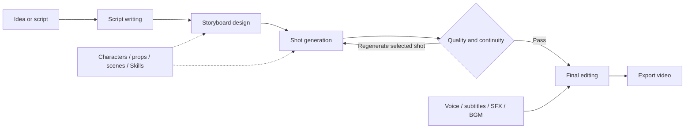

# SceneForge

[English](readme.md) | [简体中文](README_ZH.md)

SceneForge is a local-first AI production studio for short dramas and social videos. It turns an idea or imported script into a reviewable workflow covering script writing, storyboard design, shot generation, and final editing.

## See It In Action

AI-generated sample videos produced end to end with SceneForge. Click a preview to open the full MP4.

<table>
  <tr>
    <td width="50%" align="center">
      <a href="docs/media/rainy-office-demo.mp4"></a><br>
      <sub><b>Rainy Office</b> - consistent character, location, and visual tone across shots</sub>
    </td>
    <td width="50%" align="center">
      <a href="docs/media/laundromat-demo.mp4"></a><br>
      <sub><b>Laundromat</b> - a compact narrative sequence with action and subtitles</sub>
    </td>
  </tr>
</table>

## Production Workflow



## Highlights

- Four-stage production workflow with review, revision, interruption, and resume support.
- Character, prop, scene, style Skill, and optional LoRA asset libraries.
- Per-shot keyframe generation, history, rollback, quality checks, and continuity controls.
- Subtitles, voice-over, sound effects, background music, cost estimates, and final assembly.
- Light and dark themes plus a configurable media storage directory.
- Local Web UI with durable jobs and project history.

## Quick Start

Requirements: Python 3.12, `uv`, Node.js 22+, `npm`, and FFmpeg available on `PATH`.

```powershell
uv sync --frozen
cd frontend
npm ci
npm run build
cd ..
.\start.bat
```

On macOS or Linux, replace the last command with `uv run python main_server.py`. The default address is `http://127.0.0.1:8770/`.

## Provider Configuration

Configure providers in Settings, copy `configs/agent.example.yaml` to the ignored `configs/agent.local.yaml`, or use environment variables such as `SCENEFORGE_API_KEY`, `SCENEFORGE_LLM_API_KEY`, `SCENEFORGE_IMAGE_API_KEY`, and `SCENEFORGE_VIDEO_API_KEY`. Never add credentials to the public pipeline templates.

Model calls may send prompts, reference media, and generation parameters to external providers and may incur charges. Review the selected provider's privacy, retention, content, and billing terms before use.

## Command Line

On macOS or Linux, the terminal interface is available through:

```bash
./sceneforge tui
./sceneforge tui new
```

## Data

- Project state: `.sceneforge/`
- Generated media: `.working_dir/` by default, configurable in Settings
- User assets: `assets/`
- User style Skills: `skills_user/`

Existing installations using `.vimax/` or `VIMAX_*` settings are migrated or read through a compatibility layer.

Runtime data, local provider configuration, generated media, user assets, and user Skills are excluded from source control by default.

## Security

The Web service is intended to bind to `127.0.0.1`. Set `SCENEFORGE_WEB_TOKEN` or pass `--token` before using a non-loopback host. See [SECURITY.md](SECURITY.md) for vulnerability reporting and deployment guidance.

## Development

```bash
uv run python scripts/check_repo_hygiene.py
uv run pytest -q
cd frontend && npm run build
cd ../ui && npm test
```

See [CONTRIBUTING.md](CONTRIBUTING.md) before submitting code or assets.

## Upstream And License

SceneForge began as a product-focused derivative of [HKUDS/ViMax](https://github.com/HKUDS/ViMax). The current application adds its own staged workflow, desktop-oriented Web UI, asset libraries, durable queue, editing pipeline, consistency controls, and operational tooling. See [LICENSE](LICENSE), [NOTICE](NOTICE), [THIRD_PARTY_NOTICES.md](THIRD_PARTY_NOTICES.md), and [docs/上游来源与许可证.md](docs/上游来源与许可证.md).
